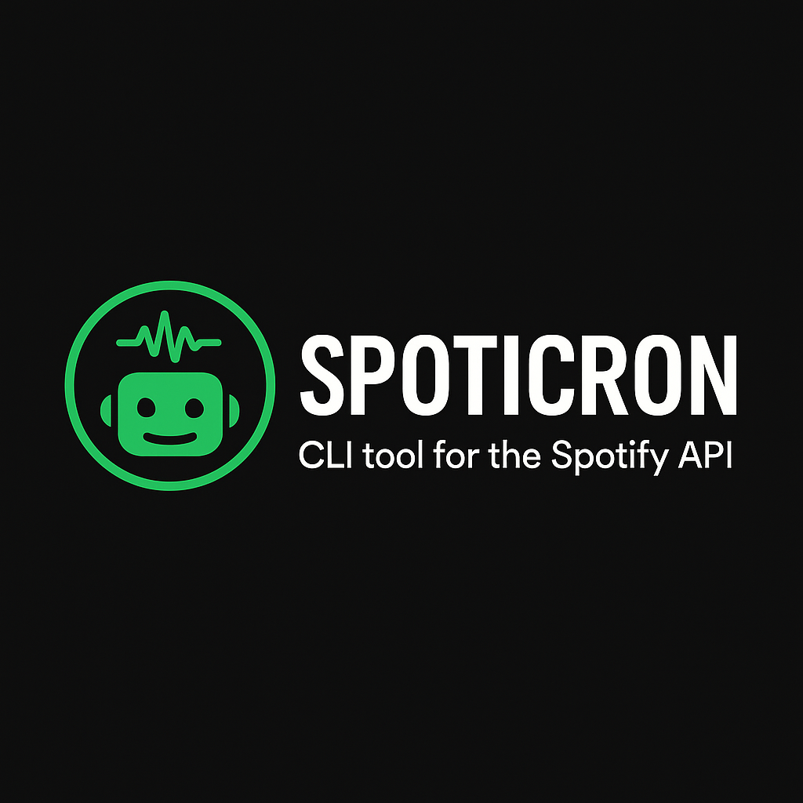

# Spoticron Branding Guidelines

## Logo Usage

<div align="center">
  
</div>

### Logo Files

- **Primary Logo**: `assets/spoticron.png`
- **Format**: PNG with transparent background
- **Usage**: README headers, documentation, social media

### Color Palette

The Spoticron branding follows Spotify's aesthetic while maintaining its own identity:

- **Primary Green**: #1DB954 (Spotify Green)
- **Dark Background**: #191414 (Spotify Dark)
- **White/Light Text**: #FFFFFF
- **Secondary Gray**: #535353

### Typography

- **Headers**: Bold, clean sans-serif fonts
- **Body Text**: Clear, readable fonts
- **Code**: Monospace fonts for technical content

### Brand Voice

- **Technical yet approachable**
- **Music-focused and passionate**
- **Data-driven and analytical**
- **User-friendly and helpful**

## Usage Examples

### GitHub Repository

- Repository social preview image
- README header logo
- Release notes and documentation

### Documentation

- Header for all documentation files
- Getting started guides
- API reference materials

### Social Media

- Twitter/X profile usage
- LinkedIn project posts
- Developer community shares

## Logo Specifications

### Minimum Size

- **Digital**: 150px width minimum
- **Print**: 1 inch width minimum

### Clear Space

- Maintain clear space around logo equal to the height of the logo
- Do not place text or other elements within this space

### Background Usage

- Logo works on dark and light backgrounds
- Ensure sufficient contrast
- Test readability on various backgrounds

## File Organization

```
assets/
├── spoticron.png          # Primary logo (current)
├── spoticron-light.png    # Light version (future)
├── spoticron-dark.png     # Dark version (future)
├── spoticron-icon.png     # Icon only (future)
└── social/
    ├── github-social.png  # GitHub social preview
    ├── twitter-card.png   # Twitter card image
    └── linkedin-post.png  # LinkedIn post image
```

## Brand Applications

### GitHub Integration

- Repository description
- Release notes
- Issue templates
- Pull request templates
- GitHub Pages (if implemented)

### Documentation

- README files
- Wiki pages
- API documentation
- User guides
- Developer documentation

### Marketing Materials

- Project announcements
- Feature highlights
- Tutorial content
- Community engagement

## Consistency Guidelines

1. **Always use the official logo file**
2. **Maintain aspect ratio**
3. **Ensure proper contrast**
4. **Follow size guidelines**
5. **Keep clear space requirements**
6. **Use consistent color palette**
7. **Apply brand voice in all text**

## Future Considerations

- **Icon variants** for different use cases
- **Animated versions** for web use
- **Vector formats** (SVG) for scalability
- **Dark/light mode** variations
- **Favicon** for web applications
- **App store** assets if mobile version develops

---

_This branding guide ensures consistent representation of Spoticron across all platforms and materials._
